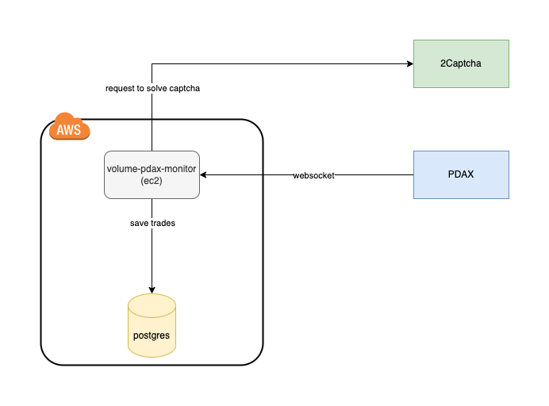

# PDAX Volume Monitor

This project focuses on monitoring the trading volume for specific cryptocurrency pairs on the [PDAX](https://pdax.ph/) trading platform in the Philippines.

> ⚠️ **Warning**
> 1. Code is written in fast-and-dirty style.
> 2. Be aware that PDAX does not currently offer an official API for this purpose. The `volume-pdax-monitor` service utilizes an unofficial WebSocket API sourced from the [PDAX trading terminal](https://trade.pdax.ph). It's important to note that if the protocol undergoes any changes, the service will require corresponding adjustments to maintain functionality.

## Schema

Below is a visual representation of the project's schema:

## Prerequisites

Before getting started with this project, there are a few prerequisites you need to fulfill:

1. **PDAX User Account:** You must have an active account on PDAX. If needed, you can create temporary accounts using services like [TempMail](https://temp-mail.org/). KYC verification is not required for these accounts. Once registered, users gain access to the [PDAX trading terminal](https://trade.pdax.ph).

2. **2Captcha Account:** Sign up and fund an account on [2Captcha](https://2captcha.com/). This service is utilized to solve Google captchas, which are encountered when obtaining a PDAX session.
